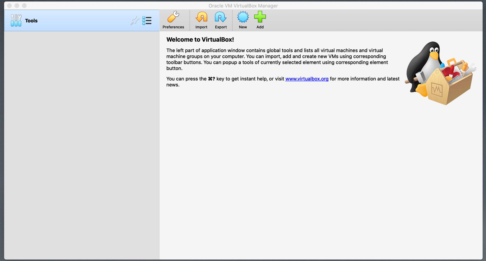

# 42-Born2BeRoot

  

## Here’s a table with resources that will help you get started with the Born2beRoot project:

| **Topic** | **Resource** | **Description** |
| --- | --- | --- |
| **Virtualization with VirtualBox/UTM** | [VirtualBox Documentation](https://www.virtualbox.org/manual/) | Learn how to install and set up VirtualBox and manage virtual machines. |
| **Rocky Linux Setup** | [Rocky Linux Official Documentation](https://docs.rockylinux.org/) | Official setup and configuration guide for Rocky Linux. |
| **Debian Setup** | [Debian Installation Guide](https://www.debian.org/releases/) | Official guide to install and configure Debian. |
| **Linux Partitioning with LVM** | [LVM Guide](https://www.digitalocean.com/community/tutorials/an-introduction-to-lvm-on-linux) | A beginner-friendly guide to LVM (Logical Volume Management) for creating encrypted partitions. |
| **Firewall Configuration (UFW & firewalld)** | [UFW (Uncomplicated Firewall) Guide](https://help.ubuntu.com/community/UFW)  [firewalld Guide](https://firewalld.org/) | UFW setup for Debian or firewalld setup for Rocky to configure the firewall with specific port restrictions. |
| **SSH Configuration** | [SSH Guide](https://www.ssh.com/academy/ssh/config) | A comprehensive guide to secure SSH configuration, including disabling root login and changing port. |
| **Password Policy Configuration** | [Password Policy Guide (Linux)](https://www.redhat.com/sysadmin/linux-password-policy) | A guide to set up strong password policies on Linux systems, including expiration, complexity, and restrictions. |
| **Sudo Configuration** | [Sudo Configuration Guide](https://linux.die.net/man/5/sudoers) | Official sudo configuration documentation with tips on securing sudo access and logging. |
| **Bash Scripting** | [Bash Scripting Guide](https://www.gnu.org/software/bash/manual/bashref.html) | Learn how to write and automate tasks with Bash scripting, including cron jobs. |
| **System Monitoring with `top`, `htop`, `free`, etc.** | [Linux System Monitoring Tools](https://www.linode.com/docs/guides/linux-monitoring-tools/) | Resource explaining common Linux system monitoring tools such as `top`, `htop`, `free`, and others to monitor CPU, RAM, and disk usage. |
| **Scripting with `wall`** | [Linux wall Command](https://man7.org/linux/man-pages/man1/wall.1.html) | Learn how to use the `wall` command to broadcast messages to all users on a system. |
| **Linux Users and Groups** | [Linux Users and Groups](https://www.tutorialspoint.com/unix/unix-users.htm) | Guide to managing users and groups on Linux, including `useradd`, `usermod`, and setting user groups. |
| **SELinux & AppArmor** | [SELinux Guide](https://www.centos.org/docs/5/html/SELinux/)  [AppArmor Documentation](https://gitlab.com/apparmor/apparmor) | Learn about SELinux (for Rocky Linux) and AppArmor (for Debian) and how to configure them for security. |
| **System Architecture & Kernel Version** | [Linux Kernel Info](https://www.kernel.org/doc/html/latest/) | Official Linux Kernel documentation with details on the architecture and kernel version. |
| **LVM Status** | [LVM Command Reference](https://man7.org/linux/man-pages/man8/lvs.8.html) | Command reference for managing and checking LVM (Logical Volume Manager) status. |

### Additional Resources:

- **Linux Command Line Basics**: [Linux Command Line Basics](https://ubuntu.com/tutorials/command-line-for-beginners) - Learn the essentials of the Linux command line for system administration.
- **Linux System Administration Basics**: [Linux Administration Guide](https://www.tutorialspoint.com/unix/) - Basic administration tasks such as managing files, processes, and users on Linux.

These resources should provide a solid foundation to start working on the **Born2beRoot** project, helping you understand the system setup, security configurations, scripting, and overall system administration tasks required.

[Two Types of Hypervisors](https://www.notion.so/Two-Types-of-Hypervisors-2c3e6e3c12ea8088b926f82ec98d10f2?pvs=21)

**Step 1: Open Virtual Machine**

To begin, ensure that your virtualization software is installed and configured correctly. Follow the setup instructions provided in the resources above.
This is the home page you will get after running the virtual box.

  

